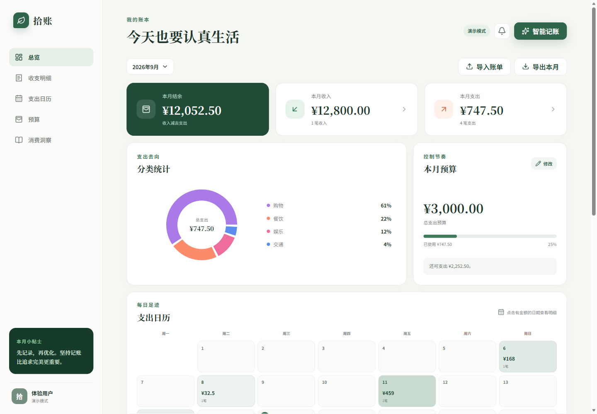
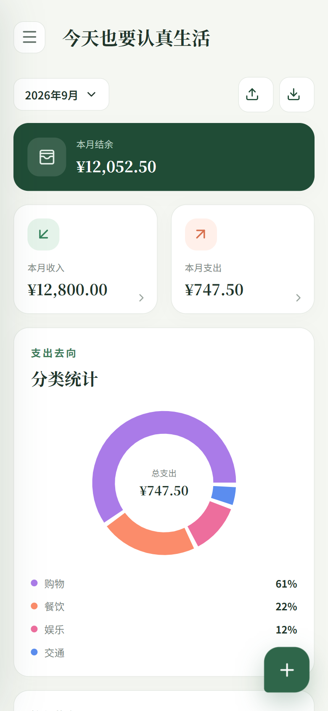
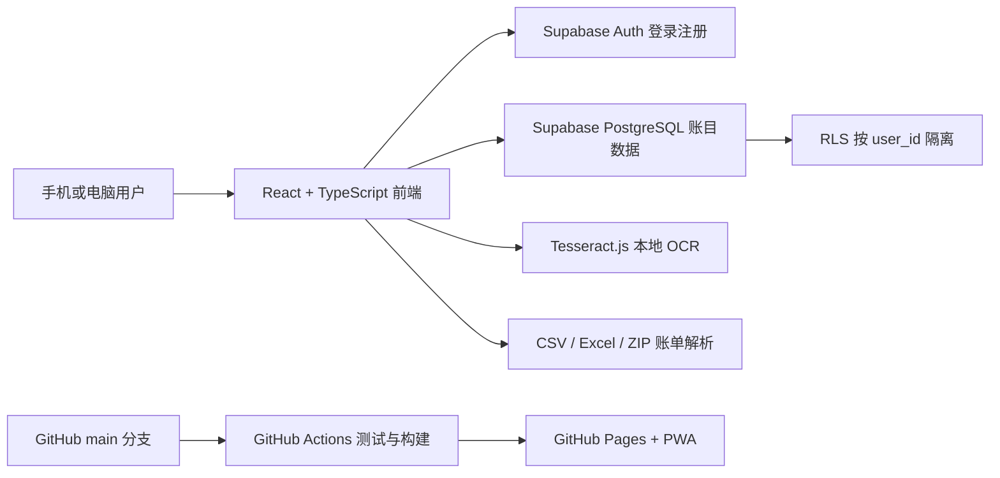

# 拾账

一款面向手机和电脑浏览器的中文个人记账应用。支持自然语言记账、支付截图识别、账单文件导入、月度预算和消费分析，每位注册用户拥有独立账本。

> **在线体验：<https://3230050028-prog.github.io/shizhang/>**
> 无账号时可以注册使用；本地未配置 Supabase 时会自动进入演示模式。

## 界面预览

| 电脑端 | 手机端 |
| --- | --- |
|  |  |

截图使用演示数据，不包含真实用户账目。

## 项目亮点

- 支持“午饭35”“昨天买奶茶12.5元”等自然语言记账，也能一次拆分多笔收支。
- 使用 Tesseract.js 在浏览器本地识别支付截图，图片不会上传到第三方 OCR 服务。
- 支持微信、支付宝导出的 CSV、TXT、Excel 和 ZIP 账单，并提供预览、重复检查和批量确认。
- 自动过滤账单截图中的月度收入、支出合计，避免把汇总金额误记成单笔消费。
- 提供月度收支、预算进度、分类图表、支出日历、搜索筛选和周期账单提醒。
- 使用 Supabase Auth、PostgreSQL 和 RLS，保证不同用户只能访问自己的账目。
- 支持安装到手机桌面的 PWA，可独立全屏启动并提示安全更新。

## 技术架构



| 模块 | 技术 | 作用 |
| --- | --- | --- |
| 界面 | React、TypeScript、Vite | 组件化页面、类型检查和快速构建 |
| 数据与登录 | Supabase Auth、PostgreSQL、RLS | 注册登录、云端保存和用户数据隔离 |
| 智能输入 | Tesseract.js、自定义解析规则 | 图片转文字、自然语言和多笔账目解析 |
| 文件导入 | read-excel-file、zip.js | 读取 CSV、TXT、Excel 和 ZIP 支付账单 |
| 数据展示 | Recharts | 支出分类图表和月度统计 |
| PWA | vite-plugin-pwa | 桌面安装、独立启动和版本更新 |
| 工程质量 | Vitest、Oxlint、GitHub Actions | 自动测试、代码检查、构建和部署 |

## 我负责的工作

这是一个个人全栈项目，我负责从需求拆分到上线维护的完整过程：

- 设计记账流程、手机端交互、信息结构和视觉样式。
- 使用 React 和 TypeScript 实现账目增删改查、筛选、预算、图表、日历与 PWA。
- 设计 Supabase 数据表、登录流程和 RLS 用户隔离策略。
- 实现自然语言记账、截图 OCR、账单文件导入、重复检测和人工确认流程。
- 编写自动化测试，配置 GitHub Actions，并通过 GitHub Pages 持续部署。
- 根据真实手机测试持续修复日期识别、汇总金额误识别、重复导入和移动端体验问题。

## 核心流程说明

### 1. React 和 TypeScript 分别负责什么

React 把登录页、总览、记账弹窗、图表和日历拆成可以复用和更新的界面组件；当账目发生变化时，React 会自动重新计算并刷新页面。TypeScript 为账目、预算和保存结果定义固定的数据结构，在开发和构建阶段提前发现字段缺失或类型错误。

### 2. Supabase 如何隔离不同用户的账目

用户通过 Supabase Auth 注册和登录。每条账目都带有当前用户的 `user_id`，PostgreSQL 的 Row Level Security（RLS）规则只允许登录用户读取、添加、修改和删除 `user_id = auth.uid()` 的记录。因此隔离在数据库层执行，不是只靠前端隐藏。

### 3. OCR 如何从图片变成账目

支付截图先在当前设备中进行缩放、灰度和对比度增强，再交给 Tesseract.js 识别中文和数字。识别结果会经过日期、金额、商户、收支类型和汇总行过滤规则，转换为可编辑的候选账目。程序不会直接保存识别结果，用户需要逐笔检查并确认，疑似重复或识别不清的项目会显示提示。

### 4. GitHub Actions 如何自动部署

代码推送到 `main` 分支后，GitHub Actions 会自动执行 `npm ci`、`npm test`、`npm run lint` 和 `npm run build`。只有测试、检查和构建都成功，生成的 `dist` 文件才会发布到 GitHub Pages。因此失败的代码不会被部署到线上。

### 5. 如何定位、测试和修改问题

先用用户提供的真实输入或截图复现问题，再把问题缩小到自然语言解析、OCR 文字解析、数据保存或页面显示中的某一层。修改后先添加对应测试，再依次运行测试、代码检查和正式构建，最后检查 GitHub Actions 和线上页面加载的文件版本。

## 开发中遇到的问题

| 问题 | 原因 | 解决方式 |
| --- | --- | --- |
| 截图中的本月总支出被识别成一笔消费 | OCR 只能看到文字和数字，不理解页面层级 | 增加月份标题、总收入、总支出和合计行过滤，并为该场景添加自动化测试 |
| 截图日期被默认成识别当天 | 商户、金额和日期在 OCR 文本中可能被拆成多行 | 在每笔金额附近寻找最近日期；无法确认时使用当天日期并显示复核警告 |
| 同一账单可能被重复导入 | 用户可能重复选择同一文件或截图 | 使用“日期 + 收支类型 + 两位小数金额 + 标准化商户名”生成指纹，默认跳过疑似重复项 |
| 中文截图识别较慢或文字不清 | 首次需要加载本地中文模型，暗色截图对比度较低 | 复用 OCR 工作线程、限制图片像素、自动反色和增强对比度，必要时才进行第二轮识别 |
| 手机上的网页更新后仍显示旧版 | PWA Service Worker 和浏览器缓存仍保存旧资源 | 增加版本更新提示，并在发布后核对线上页面实际引用的新构建文件 |
| 保存失败时用户输入容易丢失 | 移动网络不稳定或 Supabase 请求失败 | 保存失败时保留表单内容，显示明确错误并允许用户重新提交 |

## 自动化测试

项目使用 Vitest，当前覆盖：

- “午饭35”识别为餐饮支出 35 元。
- “昨天买奶茶12.5元”识别正确日期和金额。
- 相同账目生成相同指纹，不同日期不会被误判为重复。
- OCR 文本中的月度收入和支出汇总金额不会生成单笔账目。
- 密码重置回调能进入设置新密码页面，并能识别过期链接。

```bash
npm test
npm run lint
npm run build
```

## 当前功能

- 邮箱注册、登录、忘记密码和安全重置密码。
- 每位用户独立账本，支持新增、编辑和安全删除。
- 默认与自定义分类、支付账户自动保存复用。
- 月度收入、支出、结余、预算进度和超支提醒。
- 分类图表、支出日历、搜索、组合筛选和 CSV 导出。
- 自然语言、语音转写文本和一句话多笔记账。
- 支付截图批量识别、日期匹配、汇总过滤和逐笔复核。
- CSV、TXT、Excel、ZIP 支付账单导入与重复检测。
- 常用模板和周期账单提醒。
- 响应式手机界面与可安装 PWA。
- 未配置数据库时的本地演示模式。

## 本地运行

```bash
git clone https://github.com/3230050028-prog/shizhang.git
cd shizhang
npm install
npm run dev
```

浏览器打开终端显示的网址，通常是 `http://localhost:5173`。

## 连接 Supabase

1. 在 Supabase 创建项目。
2. 在 SQL Editor 运行 `supabase/schema.sql`。
3. 把 `.env.example` 复制为 `.env.local`。
4. 填写项目的 URL 和 Publishable key。
5. 重新运行 `npm run dev`。

早期数据库还需要依次运行：

- `supabase/migrations/002_reliability.sql`
- `supabase/migrations/003_accounts.sql`

前端只能使用 Publishable key。不要把 `.env.local`、Secret key 或 Service role key 上传到公开仓库。

## 安装到手机桌面

- iPhone：使用 Safari 打开在线地址，点击“分享” → “添加到主屏幕”，并开启“作为网页 App 打开”。
- Android：使用 Chrome 打开在线地址，点击右上角菜单 → “安装应用”。

基础页面可离线打开，登录和云端账目同步仍需要网络。

## 后续计划

- AI 月度消费总结与节省建议。
- 多账本和家庭共享账本。
- 资产账户、余额和净资产趋势。
- 扩充 OCR 样本与端到端浏览器测试。
